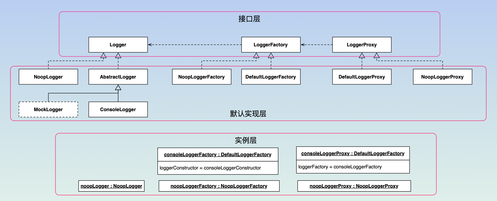

== 日志代理

`peacetrue-logger` 用于代理函数，打印其执行信息，包括：方法签名、参数和返回值。

// https://github.com/github/markup/issues/1095

== 快速上手

.安装类库：
[source%nowrap,bash]
----
npm install peacetrue-logger
----

.配置项目日志：
[source%nowrap,bash]
----
include::test/logger.ts[tags=import;basic]
----

.logger.json
[source%nowrap,typescript]
----
include::test/logger.json[]
----

.代理类：
[source%nowrap,typescript]
----
include::test/DefaultLoggerProxy.test.ts[tags=import;User;proxyClass]
----

.调用静态函数：
[source%nowrap,typescript]
----
include::test/DefaultLoggerProxy.test.ts[tags=staticFunction]
----

.静态函数日志：
[source%nowrap,log]
----
include::test/log/User.staticFunction.log[]
----

.调用类函数：
[source%nowrap,typescript]
----
include::test/DefaultLoggerProxy.test.ts[tags=classFunction]
----

.类函数日志：
[source%nowrap,log]
----
include::test/log/User.classFunction.log[]
----

.调用构造函数：
[source%nowrap,typescript]
----
include::test/DefaultLoggerProxy.test.ts[tags=constructor]
----

.构造函数日志：
[source%nowrap,log]
----
include::test/log/User.constructor.log[]
----

.调用实例函数：
[source%nowrap,typescript]
----
include::test/DefaultLoggerProxy.test.ts[tags=instanceFunction]
----

.实例函数日志：
[source%nowrap,log]
----
include::test/log/User.instanceFunction.log[]
----

.一个 React 项目中的日志：
[source%nowrap,log]
----
include::test/log/react.log[]
----

== 进阶教程

=== 类图

* 接口层：提供接口，便于自定义扩展
* 默认实现层：提供接口的默认实现
* 实例层：提供开箱即用的实例

`Noop*` 无操作系列用于切换到生产环境时使用。
`MockLogger` 在测试目录中。

=== Logger

使用控制台日志，默认日志级别为 `INFO`：

.ConsoleLogger.test.ts
[source%nowrap,typescript]
----
include::test/ConsoleLogger.test.ts[tags=import;basic]
----

输出如下日志：

[source%nowrap,text]
----
include::test/log/console.log[]
----

=== LoggerFactory

使用控制台日志工厂：

.DefaultLoggerFactory.test.ts
[source%nowrap,typescript]
----
include::test/DefaultLoggerFactory.test.ts[tags=import;basic]
----

=== LoggerProxy

使用控制台日志代理：

.DefaultLoggerProxy.test.ts
[source%nowrap,typescript]
----
include::test/DefaultLoggerProxy.test.ts[tags=import]
----

==== 代理函数

.调用函数
[source%nowrap,typescript]
----
include::test/DefaultLoggerProxy.test.ts[tags=proxyFunction]
----

.函数日志
[source%nowrap,typescript]
----
include::test/log/proxyFunction.log[]
----

==== 代理实例

.调用函数
[source%nowrap,typescript]
----
include::test/DefaultLoggerProxy.test.ts[tags=proxyInstance]
----

.函数日志
[source%nowrap,typescript]
----
include::test/log/proxyInstance.log[]
----

==== 代理类

参考 <<_快速上手>> 。

==== 选项

== 注意事项

* `DefaultLoggerProxy` 采用就地执行模式，无法代理后续新增的属性；如果属性值被更改则代理失效
* 异步执行可能会对方法层级产生不确定的负面影响
* 不代理继承的方法和 `Object` 上的方法
